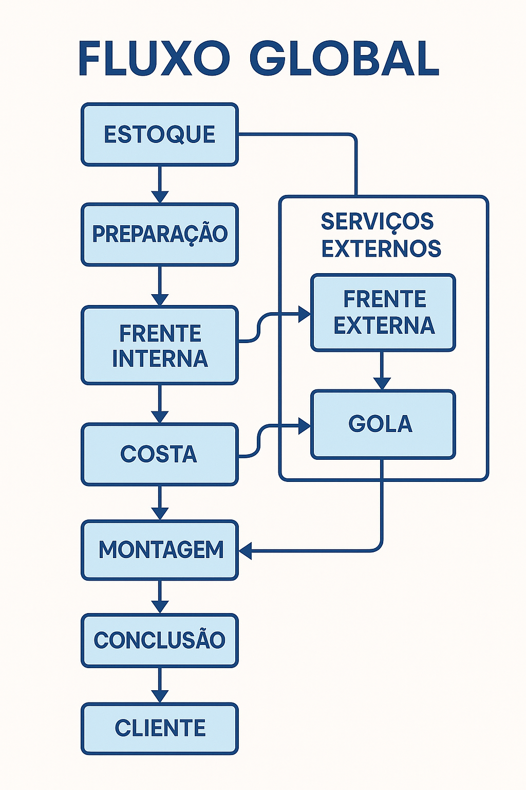

### 📈 Fluxo de Negócios da Confecção

O ciclo operacional de uma empresa de confecção que utiliza o sistema segue os seguintes passos:

1.  **Contratação:** Um cliente final contrata a empresa para confeccionar um lote de produtos (roupas).
2.  **Ordem de Produção (OP):** A empresa cria uma **Ordem de Produção** no sistema, detalhando a encomenda, prazo e valor a receber.
3.  **Aquisição de Insumos:** Para executar a OP, a empresa compra matérias-primas e contrata serviços de terceiros (fornecedores), gerando contas a pagar.
4.  **Gestão de Estoque:** O sistema gerencia o estoque de matérias-primas, dando baixa nos insumos utilizados na produção.
5.  **Execução e Acompanhamento:** A OP passa por um fluxo de trabalho (ex: corte, costura, acabamento). O gestor atualiza o status da OP em uma timeline visual, permitindo o acompanhamento em tempo real.
6.  **Gestão Financeira:** O sistema consolida as **contas a receber** (das OPs) e as **contas a pagar** (insumos, serviços, despesas administrativas), oferecendo uma visão clara da saúde financeira.
7.  **Análise e Relatórios:** Dashboards e relatórios (DRE, Fluxo de Caixa, KPIs de produção) fornecem insights para a tomada de decisão.

---

### 🧩 Módulos do Sistema

* **Core:**
    * Arquitetura `TenantBase` (modelos e managers).
    * Gestão de Planos de Assinatura (`Básico`, `Profissional`, `Enterprise`).
    * Modelos de Billing (`GatewayPagamento`, `TransacaoPagamento`, `CupomDesconto`).
* **Accounts:**
    * Gestão de usuários, perfis (`UserProfile`) e permissões por empresa (`UsuarioEmpresa`).
* **Empresas:**
    * Configurações gerais do tenant (nome, dias úteis, moeda padrão, etc.).
* **Cadastros:**
    * **Clientes:** Quem contrata a confecção.
    * **Fornecedores:** De quem a confecção compra insumos.
    * **Produtos:**
        * Cadastro de produtos acabados.
        * Tabelas auxiliares: categorias, NCM.
        * Grades de características (Letras: `P`, `M`, `G`; Números: `38`, `40`, `42`; Idade).
        * Composição de matéria-prima por produto.
* **Estoque:**
    * Gestão de entrada e saída de matérias-primas (insumos).
* **Produção:**
    * Criação e gestão completa das **Ordens de Produção (OPs)**.
    * Timeline visual para acompanhamento do status de cada OP.
    * Dashboard de produção com filtros (status, prazo, cliente).
    * Alertas automáticos para OPs com prazo de entrega próximo.
* **Financeiro:**
    * **Contas a Pagar:** Classificação de despesas (administrativas, produção).
    * **Contas a Receber:** Vinculadas às OPs entregues.
    * Fluxo de Caixa.
* **Relatórios:**
    * Relatórios gerenciais e financeiros (`DRE`, `Fluxo de Caixa`).
    * Relatórios operacionais (Produção, Estoque, Vendas por Produto).
    * Dashboard com KPIs customizáveis.
* **API:**
    * API REST completa para integrações com sistemas externos.

## 📐 FASE 1: ARQUITETURA E PLANEJAMENTO

### 1.1 Estrutura Multitenant

Estratégia: Schema Compartilhado com Isolamento por Empresa  
\- Todas as empresas no mesmo banco  
\- Campo 'empresa\_id' em todos os modelos sensíveis  
\- Middleware para filtrar dados por empresa  
\- Managers customizados para isolamento automático

### 1.2 Estrutura de Diretórios

confeccao\_saas/  
├── apps/  
│   ├── accounts/          \# Autenticação e usuários  
│   ├── core/              \# Modelos base e middleware  
│   ├── empresas/          \# Gestão de empresas  
│   ├── cadastros/         \# Clientes, fornecedores, produtos  
│   ├── producao/          \# Ordens de produção  
│   ├── financeiro/        \# Pagamentos, fluxo de caixa  
│   ├── relatorios/        \# Relatórios e dashboards  
│   └── api/               \# API REST  
├── static/  
├── media/  
├── templates/  
└── requirements/

### 1.3 Planos de Assinatura

Básico: R$ 49/mês  
\- 1 empresa  
\- 100 OPs/mês  
\- Relatórios básicos

Profissional: R$ 99/mês  
\- 3 empresas  
\- 500 OPs/mês  
\- Relatórios avançados  
\- API access

Enterprise: R$ 199/mês  
\- Empresas ilimitadas  
\- OPs ilimitadas  
\- Relatórios personalizados  
\- Suporte prioritário

## 🚀 FASE 2: DESENVOLVIMENTO \- ETAPAS DETALHADAS

### ETAPA 2.1: Configuração Base (2 dias)

2.1.1 Setup Inicial

* \[x\] \~\~Configurar projeto Django\~\~  
* \[ \] Configurar settings para produção/desenvolvimento  
* \[ \] Setup PostgreSQL  
* \[ \] Configurar Redis e Celery  
* \[ \] Setup logging e monitoramento

2.1.2 Autenticação Base

\# Estrutura de usuários  
User (Django padrão)  
├── UserProfile (estendido)  
│   ├── telefone  
│   ├── cargo  
│   └── foto\_perfil  
└── UsuarioEmpresa (many-to-many)  
    ├── empresa  
    ├── usuario  
    ├── role (admin, gerente, operador)  
    └── ativo

### ETAPA 2.2: Core e Middleware (1 dia)

2.2.1 Modelos Base

class TenantBaseModel(models.Model):  
    empresa \= models.ForeignKey(Empresa, on\_delete=models.CASCADE)  
    created\_at \= models.DateTimeField(auto\_now\_add=True)  
    updated\_at \= models.DateTimeField(auto\_now=True)  
      
    class Meta:  
        abstract \= True

class TenantManager(models.Manager):  
    def get\_queryset(self):  
        \# Filtro automático por empresa logada  
        pass

2.2.2 Middleware Multitenant  
class TenantMiddleware:  
    \# Detecta empresa atual  
    \# Injeta empresa\_id em todas as queries  
    \# Valida permissões de acesso

### ETAPA 2.3: Sistema de Empresas (2 dias)

2.3.1 Fluxo de Cadastro

1\. Usuário se registra (sem empresa)  
2\. Página de boas-vindas  
3\. Cadastro de empresa  
4\. Seleção de plano  
5\. Dashboard inicial

2.3.2 Modelos de Empresa

### ETAPA 2.4: Módulos Principais (8 dias)

2.4.1 Módulo Cadastros (2 dias)

* Clientes (CRUD completo)  
* Fornecedores/Faccionistas  
* Produtos/Categorias  
* Tipos de Facção

2.4.2 Módulo Produção (3 dias)

* Ordens de Produção  
* Controle de Status  
* Dashboard de Produção  
* Alertas de Prazo

2.4.3 Módulo Financeiro (3 dias)

* Pagamentos/Recebimentos  
* Fluxo de Caixa  
* Classificação de Gastos  
* Conciliação Bancária

### ETAPA 2.5: Frontend e UX (4 dias)

2.5.1 Templates Base  
base.html  
├── sidebar.html (navegação)  
├── header.html (empresa atual, usuário)  
├── modals.html (modals reutilizáveis)  
└── scripts.html (Chart.js, Bootstrap)  
2.5.2 Dashboard Principal

* Cards com indicadores  
* Gráficos em tempo real  
* Lista de OPs em andamento  
* Alertas e notificações

2.5.3 Formulários Inteligentes

* Auto-complete para clientes  
* Validação em tempo real  
* Upload de arquivos  
* Máscaras de input

### ETAPA 2.6: Relatórios e Analytics (3 dias)

2.6.1 Relatórios Padrão  
\# Relatórios implementados  
\- DRE Mensal/Anual  
\- Fluxo de Caixa  
\- Produção por Período  
\- Performance por Cliente  
\- Análise de Rentabilidade  
2.6.2 Dashboard Analytics

// Gráficos Chart.js  
\- Faturamento mensal (linha)  
\- Produção por categoria (pizza)  
\- Status das OPs (donut)  
\- Fluxo de caixa (barras)

### ETAPA 2.7: API e Integrações (2 dias)

2.7.1 API REST

\# Endpoints principais  
/api/v1/empresas/  
/api/v1/clientes/  
/api/v1/produtos/  
/api/v1/ordens-producao/  
/api/v1/pagamentos/  
/api/v1/relatorios/

2.7.2 Webhooks

* Notificações de vencimento  
* Alertas de produção  
* Relatórios automáticos

## 🔒 FASE 3: SEGURANÇA E PERMISSÕES

### 3.1 Sistema de Permissões

ROLES \= {  
    'ADMIN': \['all\_permissions'\],  
    'GERENTE': \['view\_relatorios', 'manage\_ops', 'manage\_cadastros'\],  
    'OPERADOR': \['view\_ops', 'edit\_ops', 'view\_cadastros'\],  
    'VIEWER': \['view\_only'\]  
}

### 3.2 Auditoria

class AuditLog(models.Model):  
    \# Log de todas as ações importantes  
    usuario \= models.ForeignKey(User)  
    empresa \= models.ForeignKey(Empresa)  
    acao \= models.CharField()  
    modelo \= models.CharField()  
    registro\_id \= models.IntegerField()  
    dados\_antes \= models.JSONField()  
    dados\_depois \= models.JSONField()

## 📊 FASE 4: PERFORMANCE E OTIMIZAÇÃO

### 4.1 Otimizações de Banco

* Índices compostos para empresa\_id  
* Particionamento por empresa (futuro)  
* Cache Redis para dados frequentes  
* Pagination em todas as listas

### 4.2 Cache Strategy

\# Cache por empresa  
cache\_key \= f"empresa\_{empresa\_id}\_dashboard\_data"  
\# Cache de 15 minutos para dashboards  
\# Cache de 1 hora para relatórios

## 🚢 FASE 5: DEPLOY E MONITORAMENTO

### 5.1 Infraestrutura

\# Docker Compose para desenvolvimento  
services:  
  web: Django \+ Gunicorn  
  db: PostgreSQL 14  
  redis: Redis 7  
  celery: Celery Worker  
  nginx: Proxy reverso

### 5.2 Monitoramento

* Sentry para erros  
* New Relic para performance  
* Logs estruturados  
* Health checks

## 📅 CRONOGRAMA DETALHADO

| Semana | Atividades | Entregáveis |
| :---- | :---- | :---- |
| 1 | Setup \+ Core \+ Empresas | Base funcional |
| 2 | Cadastros \+ Autenticação | Módulos básicos |
| 3 | Produção \+ Frontend Base | OPs funcionais |
| 4 | Financeiro \+ Dashboard | Sistema completo |
| 5 | Relatórios \+ API | Analytics |
| 6 | Testes \+ Deploy | Sistema em produção |

---

## ✅ CRITÉRIOS DE ACEITAÇÃO

### Funcionais

* \[x\] Usuário pode se cadastrar  
* \[ \] Empresa pode ser criada e gerenciada  
* \[ \] Sistema isola dados por empresa  
* \[ \] OPs podem ser criadas e acompanhadas  
* \[ \] Relatórios são gerados corretamente  
* \[ \] Dashboard apresenta dados em tempo real

### Não Funcionais

* \[ \] Sistema suporta 100 usuários simultâneos  
* \[ \] Tempo de resposta \< 2 segundos  
* \[ \] Uptime \> 99.5%  
* \[ \] Backup automático diário  
* \[ \] SSL/HTTPS obrigatório

---

## 🎨 WIREFRAMES PRINCIPAIS

1\. Landing Page  
   ├── Hero Section  
   ├── Features  
   ├── Pricing  
   └── CTA Cadastro

2\. Dashboard  
   ├── Header (empresa, usuário)  
   ├── Sidebar (navegação)  
   ├── Cards indicadores  
   ├── Gráficos  
   └── Lista de OPs

3\. Cadastro de OP  
   ├── Form wizard  
   ├── Auto-complete  
   ├── Preview  
   └── Confirmação  
